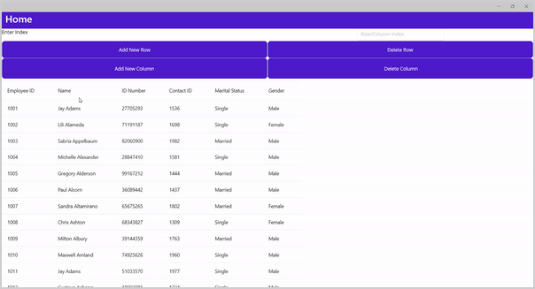

# Add and Delete Rows and Columns at runtime in MAUI DataGrid
In.NET [MAUI DataGrid](https://www.syncfusion.com/maui-controls/maui-datagrid) (SfDataGrid) allows you to dynamically manage rows and columns at runtime through its integration with the [INotifyCollectionChanged](https://learn.microsoft.com/en-us/dotnet/api/system.componentmodel.inotifypropertychanged?view=net-7.0) interface. When you set the [ItemsSource](https://help.syncfusion.com/cr/maui/Syncfusion.Maui.DataGrid.SfDataGrid.html#Syncfusion_Maui_DataGrid_SfDataGrid_ItemsSource) of the grid to a collection that implements this interface, such as an `ObservableCollection`, the SfDataGrid will automatically refresh its view whenever you add or remove rows or columns.

Refer the below code example for adding and removing Rows and Columns in SfDataGrid.
## C#

```C#
private void AddRowButton_Clicked(object sender, EventArgs e)
{
    if (Index.Text != null && Convert.ToInt32(Index.Text) < (this.viewModel.Employees.Count)
    && Convert.ToInt32(Index.Text) >= 0)
    {
        Employee newItem = new Employee()
        {
            EmployeeID = 1001,
            Name = "Added Row",
            IDNumber =14417807,
            ContactID = 2014,
            ManagerID =  60,
            LoginID = "Row",
            Gender = "ABC",
            Title = "ABC",
            MaritalStatus ="XYZ",
            SickLeaveHours = 15,
            Salary =200000,
            EmployeeStatus = false,
            Rating = 4
        };
        this.viewModel.Employees.Insert(Convert.ToInt32(Index.Text), newItem);
    }
    else
        Index.Text = "";
}

private void DeleteRowButton_Clicked(object sender, EventArgs e)
{
    if (Index.Text != null && Convert.ToInt32(Index.Text) < (this.viewModel.Employees.Count)
    && Convert.ToInt32(Index.Text) >= 0)
        this.viewModel.Employees.RemoveAt(Convert.ToInt32(Index.Text));
    else
        Index.Text = "";
}

private void DeleteColumnButton_Clicked(object sender, EventArgs e)
{
    if (Index.Text != null && Convert.ToInt32(Index.Text) < (dataGrid.Columns.Count)
    && Convert.ToInt32(Index.Text) >= 0)
        dataGrid.Columns.RemoveAt(Convert.ToInt32(Index.Text));
    else
        Index.Text = "";
}

private void AddColumnButton_Clicked(object sender, EventArgs e)
{
    if (Index.Text != null && Convert.ToInt32(Index.Text) < (dataGrid.Columns.Count)
    && Convert.ToInt32(Index.Text) >= 0)
    {
        var col = new DataGridTextColumn()
        {
            MappingName = "AddedColumn",
            HeaderText = "AddedColumn"
        };
        dataGrid.Columns.Insert(Convert.ToInt32(Index.Text), col);
    }
    else
        Index.Text = "";
}
```
## XAML
```XAML
<ContentPage.BindingContext>
    <local:EmployeeViewModel x:Name="viewModel"/>
</ContentPage.BindingContext>

<Grid>
    <Grid.RowDefinitions>
        <RowDefinition Height="150" />
        <RowDefinition Height="*" />
    </Grid.RowDefinitions>
    <syncfusion:SfDataGrid x:Name="dataGrid"
            ItemsSource="{Binding Employees}"
            ColumnWidthMode="Auto"
            Grid.Row="1">

        <syncfusion:SfDataGrid.Columns>
            <syncfusion:DataGridTextColumn MappingName="EmployeeID" />
            <syncfusion:DataGridTextColumn MappingName="Name" />
            <syncfusion:DataGridTextColumn MappingName="IDNumber" />
            <syncfusion:DataGridTextColumn MappingName="Title" />
            <syncfusion:DataGridTextColumn MappingName="ContactID" />
            <syncfusion:DataGridTextColumn MappingName="MaritalStatus" />
            <syncfusion:DataGridTextColumn MappingName="Gender" />
        </syncfusion:SfDataGrid.Columns>
    </syncfusion:SfDataGrid>

    <Grid Grid.Row="0">
        <Grid.RowDefinitions>
            <RowDefinition Height="35"></RowDefinition>
            <RowDefinition Height="50"></RowDefinition>
            <RowDefinition Height="60"></RowDefinition>
        </Grid.RowDefinitions>

        <Grid.ColumnDefinitions>
            <ColumnDefinition Width=".5*"></ColumnDefinition>
            <ColumnDefinition Width=".5*"></ColumnDefinition>
        </Grid.ColumnDefinitions>

        <Label x:Name="I" Grid.Row="0" Grid.Column="0" 
            HorizontalOptions="FillAndExpand" VerticalOptions="FillAndExpand" 
            Text="Enter Index"/>

        <Entry x:Name="Index" Grid.Row="0" Grid.Column="1"
           Keyboard="Numeric" 
           WidthRequest="250" 
           VerticalOptions="FillAndExpand" 
           HorizontalOptions="FillAndExpand"
           Placeholder="Row/Column Index"/>

        <Button x:Name="AddRowButton" Grid.Row="1"
            Grid.Column="0" Text="Add New Row" 
            Clicked="AddRowButton_Clicked" 
            VerticalOptions="FillAndExpand" 
            HorizontalOptions="FillAndExpand" />

        <Button x:Name="DeleteRowButton" Grid.Row="1" 
            Grid.Column="1" 
            Text="Delete Row" 
            VerticalOptions="FillAndExpand" 
            HorizontalOptions="FillAndExpand" 
            Clicked="DeleteRowButton_Clicked"/>

        <Button x:Name="AddColumnButton" Grid.Row="2" 
            Grid.Column="0" 
            Text="Add New Column"
            Clicked="AddColumnButton_Clicked" 
            VerticalOptions="FillAndExpand" 
            HorizontalOptions="FillAndExpand" />

        <Button x:Name="DeleteColumnButton" Grid.Row="2"
            Grid.Column="1" Text=" 
            Delete Column"
            VerticalOptions="FillAndExpand" 
            HorizontalOptions="FillAndExpand" 
            Clicked="DeleteColumnButton_Clicked"/>
    </Grid>
</Grid>
```

### Conclusion
I hope you enjoyed learning about how to add and remove rows and columns in MAUI DataGrid (SfDataGrid).
You can refer to our [.NET MAUI DataGrid’s feature tour](https://www.syncfusion.com/maui-controls/maui-datagrid) page to know about its other groundbreaking feature representations. You can also explore our .NET MAUI DataGrid Documentation to understand how to present and manipulate data.
For current customers, you can check out our .NET MAUI components from the [License and Downloads](https://www.syncfusion.com/account/downloads) page. If you are new to Syncfusion, you can try our 30-day free trial to check out our .NET MAUI DataGrid and other .NET MAUI components.
If you have any queries or require clarifications, please let us know in comments below. You can also contact us through our [support forums](https://www.syncfusion.com/forums), [Direct-Trac](https://support.syncfusion.com/account/login?ReturnUrl=%2Faccount%2Fconnect%2Fauthorize%2Fcallback%3Fclient_id%3Dc54e52f3eb3cde0c3f20474f1bc179ed%26redirect_uri%3Dhttps%253A%252F%252Fsupport.syncfusion.com%252Fagent%252Flogincallback%26response_type%3Dcode%26scope%3Dopenid%2520profile%2520agent.api%2520integration.api%2520offline_access%2520kb.api%26state%3D8db41f98953a4d9ba40407b150ad4cf2%26code_challenge%3DvwHoT64z2h21eP_A9g7JWtr3vp3iPrvSjfh5hN5C7IE%26code_challenge_method%3DS256%26response_mode%3Dquery) or [feedback portal](https://www.syncfusion.com/feedback/maui?control=sfdatagrid). We are always happy to assist you!
